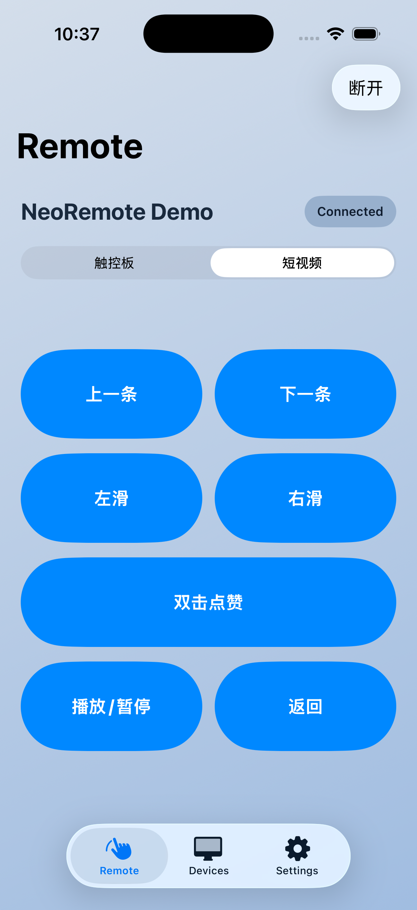

<p align="center">
  
</p>

<h1 align="center">NeoRemote</h1>

<p align="center">
  四端原生的跨设备输入工具：手机控制桌面端，也可以用 iOS / Android 控制 Android 被控端。
</p>

<p align="center">
  <strong>iOS</strong> · <strong>Android</strong> · <strong>macOS</strong> · <strong>Windows</strong>
</p>

<p align="center">
  <a href="https://github.com/Souitou-iop/NeoRemote/releases/tag/v0.1.0-beta.8">Latest beta: v0.1.0-beta.8</a>
  ·
  <a href="https://github.com/Souitou-iop/NeoRemote/actions/workflows/build-all.yml">Build all artifacts</a>
  ·
  <a href="https://github.com/Souitou-iop/NeoRemote/actions/workflows/beta-release.yml">Beta release</a>
</p>

NeoRemote 当前已经形成两条可用链路：

- **移动端控制桌面端**：iOS / Android 作为控制端，通过局域网发现 Desktop，发送触控板式输入；macOS / Windows 作为桌面接收端，把命令注入为系统鼠标事件。
- **移动端控制 Android**：Android 可通过 AccessibilityService 作为被控端发布服务；iOS / Android 控制端连接后可执行点击、滑动、系统返回，以及面向短视频 App 的视频控制动作。

项目坚持四端原生实现，不使用 Flutter、React Native、Electron 等跨端壳。

| 平台 | 技术栈 | 当前角色 |
| --- | --- | --- |
| iOS | Swift / SwiftUI / UIKit / Network.framework | 移动控制端，支持触控板模式与短视频模式 |
| Android | Kotlin / Jetpack Compose / Android NSD / Socket / AccessibilityService | 移动控制端 + Android 被控端 |
| macOS | Swift Package / SwiftUI / AppKit / CoreGraphics | 桌面接收端，支持辅助功能权限检测与鼠标事件注入 |
| Windows | C++20 / Win32 / SendInput | 桌面接收端，支持发现、监听与输入注入 |

## 当前能力

- **自动发现 + 手动连接**：控制端可自动发现同网段的 Desktop 或 Android 被控端，也保留 IP/端口手动兜底。
- **触控板模式**：移动端发送 `move / tap / scroll / drag`，用于控制 macOS、Windows 或 Android 被控端。
- **短视频模式**：连接后可在 Remote 页切换到专用视频控制面板，支持上一条、下一条、左滑、右滑、双击点赞、播放/暂停、返回。
- **Android 被控端**：Android 通过辅助功能接收 TCP 指令并执行点击、滑动、短视频动作和系统导航；内置动作队列，避免高频指令互相取消。
- **桌面端原生注入**：macOS 使用 CoreGraphics，Windows 使用 SendInput，不做远程桌面画面回传。
- **统一 CI / Beta 发布**：GitHub Actions 可构建 iOS IPA、Android APK、macOS app zip 和 Windows receiver zip，并创建 beta prerelease。
- **同源品牌资源**：`icon/NeoRemote.icon` 是主图标源，仓库同时保留 iOS / watchOS 导出图标和视觉资产。

## 产品进度

| 阶段 | 目标 | 状态 |
| --- | --- | --- |
| 移动端控制桌面端 | 手机作为无线鼠标/触控板控制 macOS / Windows | 可用 |
| Android 被控端 | Android 作为可发现、可连接、可控制的被控端 | 可用 |
| 视频控制模式 | 独立按钮控制短视频 App 的上下滑、左右滑、点赞、播放、返回 | 可用 |
| 四端构建产物 | iOS、Android、macOS、Windows 统一构建和 beta 发布 | 可用 |
| 更完整的输入能力 | 键盘、快捷动作、可信设备策略、多客户端仲裁 | 规划中 |

## 最新 Beta

当前最新 beta 版本：

```text
v0.1.0-beta.8
```

Release 页面：

```text
https://github.com/Souitou-iop/NeoRemote/releases/tag/v0.1.0-beta.8
```

包含产物：

- `NeoRemote-ios-unsigned.ipa`
- `NeoRemote-android-release-unsigned.apk`
- `NeoRemote-macos.zip`
- `NeoRemote-windows-receiver.zip`

说明：

- iOS 产物是 unsigned IPA，需要按开发/测试环境自行签名或安装。
- Android beta release workflow 产出 unsigned APK；`Build all artifacts` workflow 在配置签名 secrets 时会产出 signed APK。
- macOS app 为本地测试用构建，未做 notarization。

## 演示截图

以下截图来自 iOS 控制端和 macOS 接收端。移动端实际 Remote 页现在已支持 `触控板 / 短视频` 模式切换。

<table>
  <tr>
    <th>连接引导</th>
    <th>已连接控制面</th>
    <th>短视频模式</th>
  </tr>
  <tr>
    <td></td>
    <td></td>
    <td></td>
  </tr>
  <tr>
    <th>设备页</th>
    <th>设置页</th>
  </tr>
  <tr>
    <td></td>
    <td></td>
  </tr>
</table>

### Desktop

<table>
  <tr>
    <th>macOS 接收端</th>
  </tr>
  <tr>
    <td></td>
  </tr>
</table>

## 仓库结构

```text
.
├── Android/                         # Android 控制端 + Android 被控端
├── iOS/                             # iOS 控制端
├── MacOS/                           # macOS 桌面接收端
├── Windows/                         # Windows 桌面接收端
├── icon/                            # Icon Composer 主图标与导出资源
├── artwork/                         # 品牌源图形
├── assets/                          # 展示与宣传资产
├── scripts/                         # 全端资源同步脚本
├── docs/                            # PRD、协议、平台交接文档
└── .github/workflows/               # 四端构建与 beta 发布
```

## 协议与连接

NeoRemote 当前协议是 JSON over TCP。控制端发送命令，被控端或桌面端返回 `ack / status / heartbeat`。

### 发现方式

- Bonjour / DNS-SD 服务类型：`_neoremote._tcp.`
- UDP fallback 发现端口：`51101`
- UDP 请求：`NEOREMOTE_DISCOVER_V1`
- UDP 响应前缀：`NEOREMOTE_DESKTOP_V1`

Android 被控端启用辅助功能后，会发布为可发现设备；控制端会把它识别为 Android endpoint。

### 默认端口

| 目标 | 默认端口 |
| --- | --- |
| macOS 桌面接收端 | `50505` |
| Windows 桌面接收端 | `51101` |
| Android 被控端 | `51101` |
| Android ADB 有线调试 | `127.0.0.1:51101` |

ADB 有线调试可使用：

```bash
adb forward tcp:51101 tcp:51101
```

### 控制命令

```json
{ "type": "clientHello", "clientId": "...", "displayName": "iPhone", "platform": "ios" }
{ "type": "move", "dx": 12.3, "dy": -4.8 }
{ "type": "tap", "button": "primary" }
{ "type": "scroll", "deltaX": 0.0, "deltaY": 18.0 }
{ "type": "drag", "state": "started", "dx": 0.0, "dy": 0.0, "button": "primary" }
{ "type": "systemAction", "action": "back" }
{ "type": "videoAction", "action": "swipeUp" }
{ "type": "heartbeat" }
```

`videoAction` 支持：

| action | 行为 |
| --- | --- |
| `swipeUp` | 下一条 |
| `swipeDown` | 上一条 |
| `swipeLeft` | 左滑 |
| `swipeRight` | 右滑 |
| `doubleTapLike` | 双击点赞 |
| `playPause` | 播放/暂停 |
| `back` | 返回 |

### 回包

```json
{ "type": "ack" }
{ "type": "status", "message": "Android 被控端已连接" }
{ "type": "heartbeat" }
```

## Android 被控端

Android 被控端依赖系统辅助功能：

1. 安装 Android app。
2. 打开系统辅助功能设置。
3. 启用 NeoRemote 辅助服务。
4. 保持 Android 和控制端在同一局域网，或使用 ADB forward 做有线调试。
5. iOS / Android 控制端发现并连接该 Android 设备后，即可执行触控板或短视频模式命令。

被控端实现包含：

- TCP receiver：接收 JSON 命令并返回状态。
- Android NSD / UDP responder：让控制端发现 Android 被控端。
- Accessibility gesture injection：执行点击、滑动和系统导航。
- Touch trail overlay：普通触控板模式显示短暂轨迹；视频控制模式不显示轨迹，避免误解为光标。
- Action queue：连续视频动作按完成回调串行执行，减少 Accessibility 手势互相取消。

## 快速开始

### iOS

要求：

- macOS
- Xcode

常用命令：

```bash
xcodebuild build \
  -project iOS/NeoRemote.xcodeproj \
  -scheme NeoRemote \
  -destination 'generic/platform=iOS Simulator'
```

真机构建示例：

```bash
xcodebuild build \
  -project iOS/NeoRemote.xcodeproj \
  -scheme NeoRemote \
  -destination 'id=<DEVICE_ID>' \
  -configuration Debug
```

无签名归档：

```bash
xcodebuild archive \
  -project iOS/NeoRemote.xcodeproj \
  -scheme NeoRemote \
  -configuration Release \
  -destination 'generic/platform=iOS' \
  -archivePath /tmp/NeoRemote-unsigned.xcarchive \
  CODE_SIGNING_ALLOWED=NO \
  CODE_SIGNING_REQUIRED=NO \
  CODE_SIGN_IDENTITY=
```

### Android

要求：

- JDK 21
- Android SDK

常用命令：

```bash
cd Android
./gradlew :app:testDebugUnitTest
./gradlew :app:assembleDebug
./gradlew :app:assembleRelease
```

安装 debug APK：

```bash
adb install -r Android/app/build/outputs/apk/debug/app-debug.apk
```

### macOS

要求：

- macOS 15+
- Swift 6 toolchain / Xcode
- 辅助功能权限：系统设置 -> 隐私与安全性 -> 辅助功能

测试与构建：

```bash
swift test --package-path MacOS
swift build -c release --package-path MacOS
```

构建并启动桌面端：

```bash
./MacOS/script/build_and_run.sh
```

验证启动：

```bash
./MacOS/script/build_and_run.sh --verify
```

macOS 构建产物会落在：

```text
MacOS/dist/NeoRemoteMac.app
```

### Windows

要求：

- Windows 10/11
- Visual Studio 2022
- Desktop development with C++
- Windows 10/11 SDK

构建接收器：

```powershell
./Windows/scripts/build_receiver.ps1
```

构建产物：

```text
Windows/build/NeoRemote.WindowsReceiver.exe
```

## 图标同步

NeoRemote 的应用图标以 `icon/NeoRemote.icon` 为唯一设计源。调整 Icon Composer 文件后，运行：

```bash
./scripts/sync_icons.sh
```

脚本会同步：

- iOS：复制最新 `NeoRemote.icon` 到 Xcode 工程资源。
- macOS：用 `actool` 编译 `.icon`，生成 `AppIcon.icns` fallback。
- Android：生成 `mipmap-mdpi` 到 `mipmap-xxxhdpi` 的 launcher 图标。
- Windows：生成多尺寸 `NeoRemote.ico`，并供窗口和托盘图标使用。

## CI 与发布

### Build all artifacts

推送到 `main` 或手动触发 `Build all artifacts` 后会构建：

- iOS：`NeoRemote-unsigned-ipa`
- Android：`NeoRemote-android-apk`
- macOS：`NeoRemoteMac`
- Windows：`NeoRemoteWindowsReceiver`

Android release 签名依赖 GitHub Secrets：

- `ANDROID_RELEASE_KEYSTORE_BASE64`
- `ANDROID_RELEASE_KEYSTORE_PASSWORD`
- `ANDROID_RELEASE_KEY_ALIAS`
- `ANDROID_RELEASE_KEY_PASSWORD`

### Beta release

手动触发 `Beta release` workflow 可创建 GitHub prerelease。示例：

```bash
gh workflow run beta-release.yml --ref main -f version=v0.1.0-beta.8
```

## 开发边界

NeoRemote 是输入控制工具，不是远程桌面。

当前默认不做：

- 屏幕画面回传
- 文件传输
- App 内数据读写
- iPhone 作为系统级被控端
- 复杂账号体系或端到端加密
- 多客户端同时控制同一目标的完整仲裁策略

后续扩展协议时，应保持现有 JSON v1 消息兼容，再新增能力。

## 参考文档

- `docs/NeoRemote_PRD.md`
- `docs/ios-macos-handoff.md`
- `docs/cross-platform-current-progress.md`
- `docs/windows-current-progress-handoff.md`
- `docs/android-signing-preset.md`
- `Windows/README.md`
