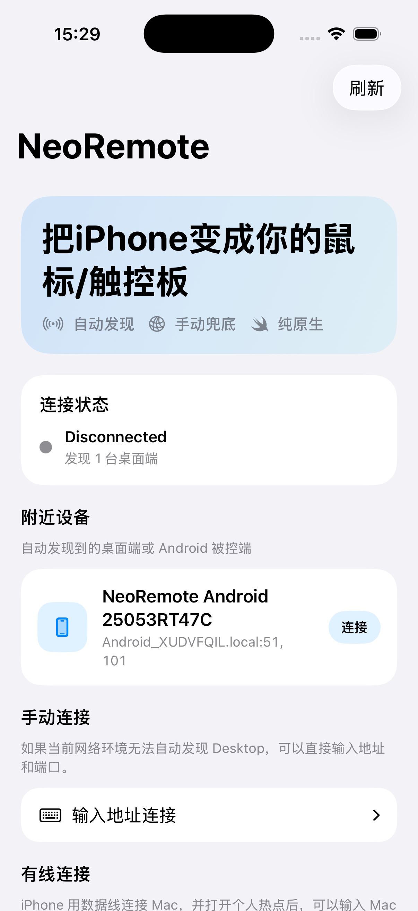
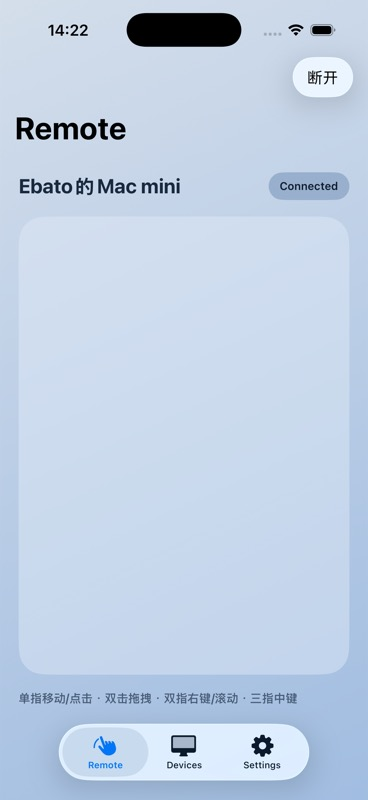
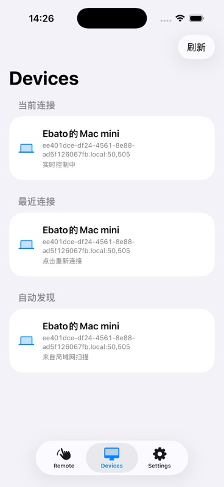
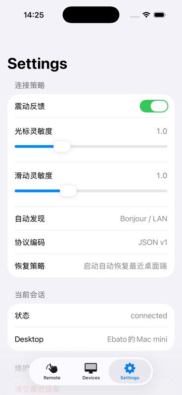
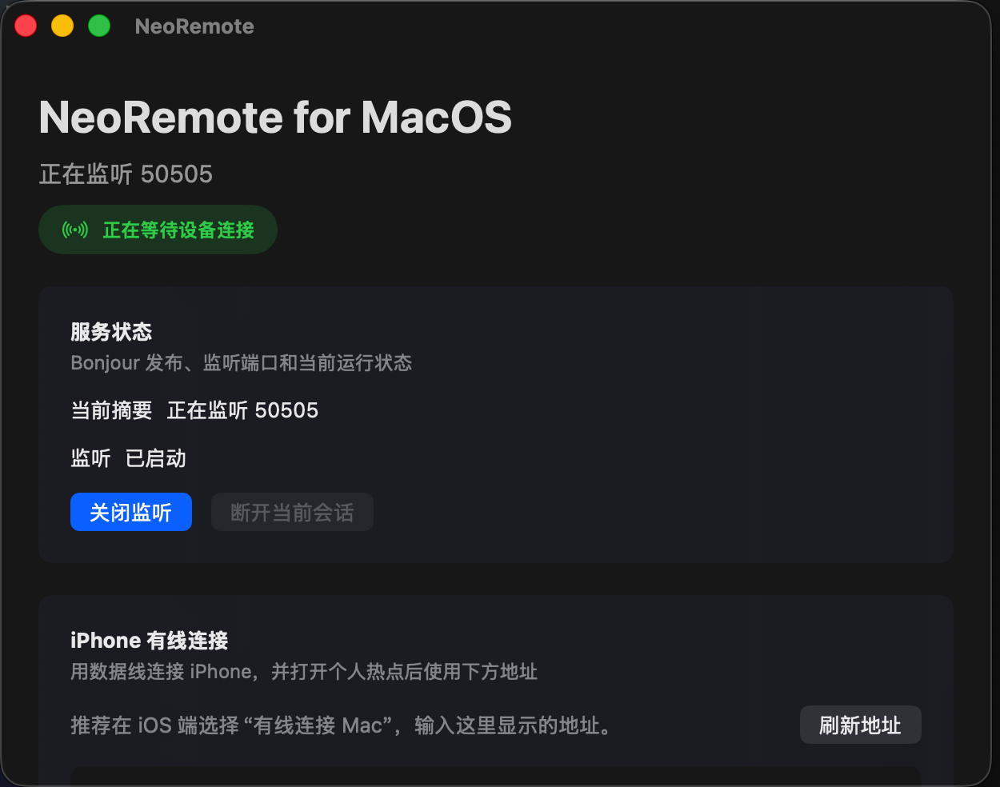

# NeoRemote

NeoRemote 是一个四端原生的无线触控板与桌面输入接收项目。移动端负责发现桌面端、建立连接并采集触控输入；桌面端负责监听连接、解析统一协议，并把移动端输入注入为系统鼠标事件。

当前仓库采用原生实现，不使用 Flutter、React Native、Electron 等跨端壳：

- iOS：Swift / SwiftUI / UIKit / Network.framework
- Android：Kotlin / Jetpack Compose / 原生 Socket / Android NSD
- macOS：Swift Package / SwiftUI / AppKit / CoreGraphics
- Windows：C++20 / Win32 / WinUI 3 预留工程 / SendInput

## 当前状态

项目已经进入跨端原型阶段：

- `iOS/`：移动控制端，支持桌面发现、手动连接、设备记录、触控板输入与设置页。
- `Android/`：移动控制端，使用 Compose 实现连接引导、远控界面、设备页与设置页。
- `MacOS/`：桌面接收端，监听 TCP、响应局域网发现、检测辅助功能权限，并通过 CoreGraphics 注入鼠标事件。
- `Windows/`：桌面接收端，包含 Core 协议层、Win32 接收器、托盘入口和构建脚本。
- `.github/workflows/build-all.yml`：统一四端构建工作流。

## 演示截图

以下截图来自 iPhone 17 模拟器中的最新版 iOS 控制端，并已连接本机 macOS 接收端。截图统一为 368 x 800，便于在 GitHub 中保持一致的展示比例。

<table>
  <tr>
    <th>连接引导</th>
    <th>已连接控制面</th>
  </tr>
  <tr>
    <td></td>
    <td></td>
  </tr>
  <tr>
    <th>设备页</th>
    <th>设置页</th>
  </tr>
  <tr>
    <td></td>
    <td></td>
  </tr>
</table>

### PC / 桌面端

以下截图来自本机最新版 macOS 接收端，展示桌面端监听、连接状态和有线连接入口。

<table>
  <tr>
    <th>macOS 接收端</th>
  </tr>
  <tr>
    <td></td>
  </tr>
</table>

## 仓库结构

```text
.
├── Android/                         # Android 控制端
├── iOS/                             # iOS 控制端
├── MacOS/                           # macOS 桌面接收端
├── Windows/                         # Windows 桌面接收端
├── docs/                            # PRD、协议、平台交接文档
└── .github/workflows/build-all.yml  # 四端统一 CI
```

## 协议与连接

NeoRemote 的首版协议是 JSON over TCP，桌面端接收移动端命令并返回状态消息。

### 发现方式

- Bonjour / DNS-SD 服务类型：`_neoremote._tcp.`
- UDP fallback 发现端口：`51101`
- UDP 请求：`NEOREMOTE_DISCOVER_V1`
- UDP 响应前缀：`NEOREMOTE_DESKTOP_V1`

### 监听端口

- macOS 默认 TCP 端口：`50505`
- Windows 接收端当前默认 TCP 端口：`51101`
- Android 有线调试入口使用 `127.0.0.1:51101`，可配合 `adb reverse tcp:51101 tcp:51101`

### 控制命令

```json
{ "type": "clientHello", "clientId": "...", "displayName": "iPhone", "platform": "iOS" }
{ "type": "move", "dx": 12.3, "dy": -4.8 }
{ "type": "tap", "button": "primary" }
{ "type": "scroll", "deltaX": 0.0, "deltaY": 18.0 }
{ "type": "drag", "state": "started", "dx": 0.0, "dy": 0.0, "button": "primary" }
{ "type": "heartbeat" }
```

### 桌面端回包

```json
{ "type": "ack" }
{ "type": "status", "message": "已连接 Desktop" }
{ "type": "heartbeat" }
```

## 快速开始

### iOS

要求：

- macOS
- Xcode

常用命令：

```bash
xcodebuild test \
  -project iOS/NeoRemote.xcodeproj \
  -scheme NeoRemote \
  -destination 'platform=iOS Simulator,name=iPhone 17'
```

无签名归档：

```bash
xcodebuild archive \
  -project iOS/NeoRemote.xcodeproj \
  -scheme NeoRemote \
  -configuration Release \
  -destination 'generic/platform=iOS' \
  -archivePath /tmp/NeoRemote-unsigned.xcarchive \
  CODE_SIGNING_ALLOWED=NO \
  CODE_SIGNING_REQUIRED=NO \
  CODE_SIGN_IDENTITY=
```

### Android

要求：

- JDK 21
- Android SDK

常用命令：

```bash
cd Android
./gradlew test
./gradlew assembleDebug
./gradlew assembleRelease
```

Android release 构建默认限制 `arm64-v8a`。

### macOS

要求：

- macOS 15+
- Swift 6 toolchain / Xcode
- 辅助功能权限：系统设置 -> 隐私与安全性 -> 辅助功能

测试与构建：

```bash
swift test --package-path MacOS
swift build -c release --package-path MacOS
```

构建并启动桌面端：

```bash
./MacOS/script/build_and_run.sh
```

验证启动：

```bash
./MacOS/script/build_and_run.sh --verify
```

macOS 构建产物会落在：

```text
MacOS/dist/NeoRemoteMac.app
```

### Windows

要求：

- Windows 10/11
- Visual Studio 2022
- Desktop development with C++
- Windows 10/11 SDK
- Windows App SDK / C++/WinRT tooling

构建接收器：

```powershell
./Windows/scripts/build_receiver.ps1
```

构建产物：

```text
Windows/build/NeoRemote.WindowsReceiver.exe
```

## CI 产物

推送到 `main` 或手动触发 GitHub Actions 后，`Build all artifacts` 会构建：

- iOS：`NeoRemote-unsigned-ipa`
- Android：`NeoRemote-android-release-signed-apk`
- macOS：`NeoRemoteMac`
- Windows：`NeoRemoteWindowsReceiver`

Android release 签名依赖 GitHub Secrets：

- `ANDROID_RELEASE_KEYSTORE_BASE64`
- `ANDROID_RELEASE_KEYSTORE_PASSWORD`
- `ANDROID_RELEASE_KEY_ALIAS`
- `ANDROID_RELEASE_KEY_PASSWORD`

## 开发边界

NeoRemote 当前产品边界是“移动端触控板 + 桌面端输入接收器”，不是远程桌面。

首版默认不做：

- 屏幕画面回传
- 文件传输
- 绝对坐标点击
- 窗口级控制协议
- 复杂配对、账号体系或端到端加密
- 多客户端同时控制同一桌面

后续扩展协议时，应先保持现有 JSON v1 消息兼容，再新增能力。

## 参考文档

- `docs/NeoRemote_PRD.md`
- `docs/ios-macos-handoff.md`
- `docs/cross-platform-current-progress.md`
- `docs/windows-current-progress-handoff.md`
- `docs/android-signing-preset.md`
- `Windows/README.md`
