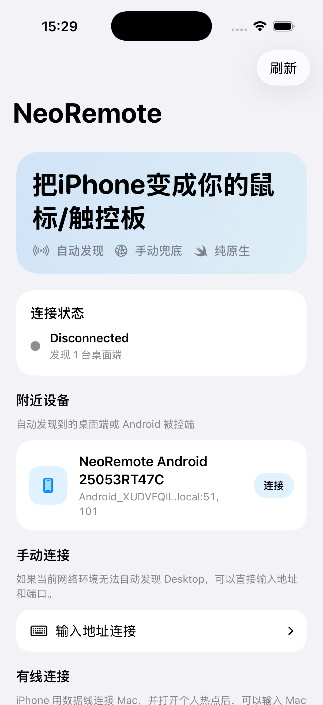
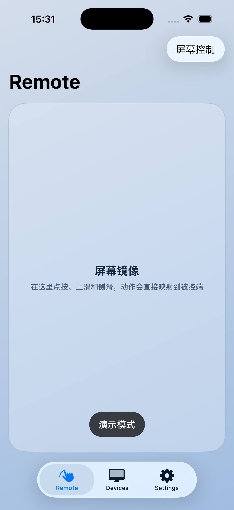
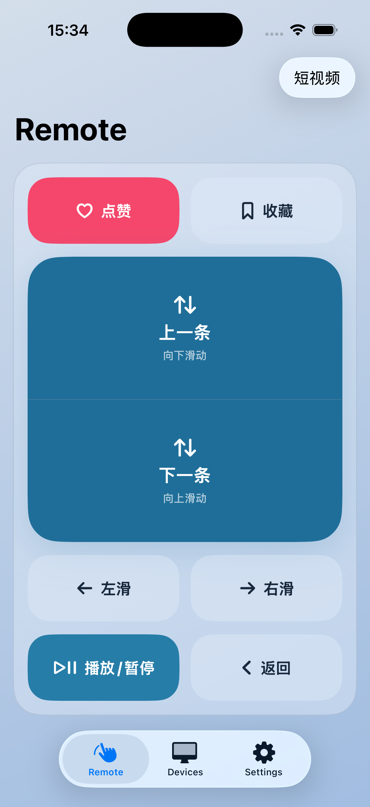
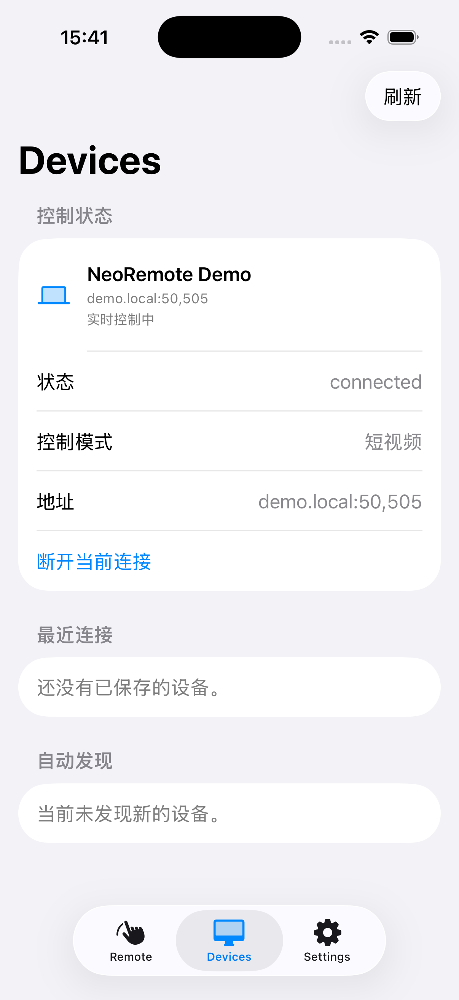
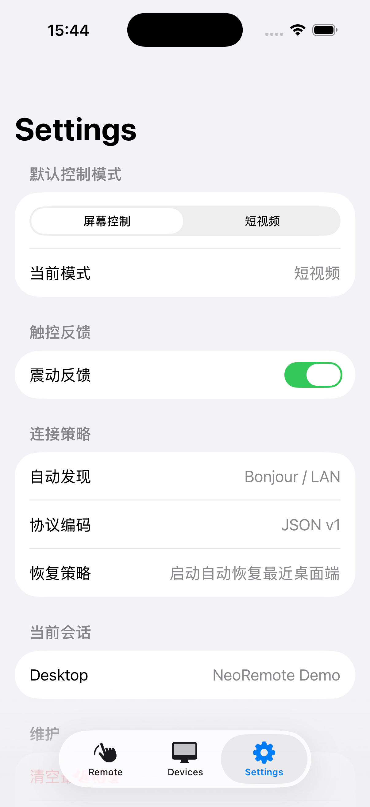
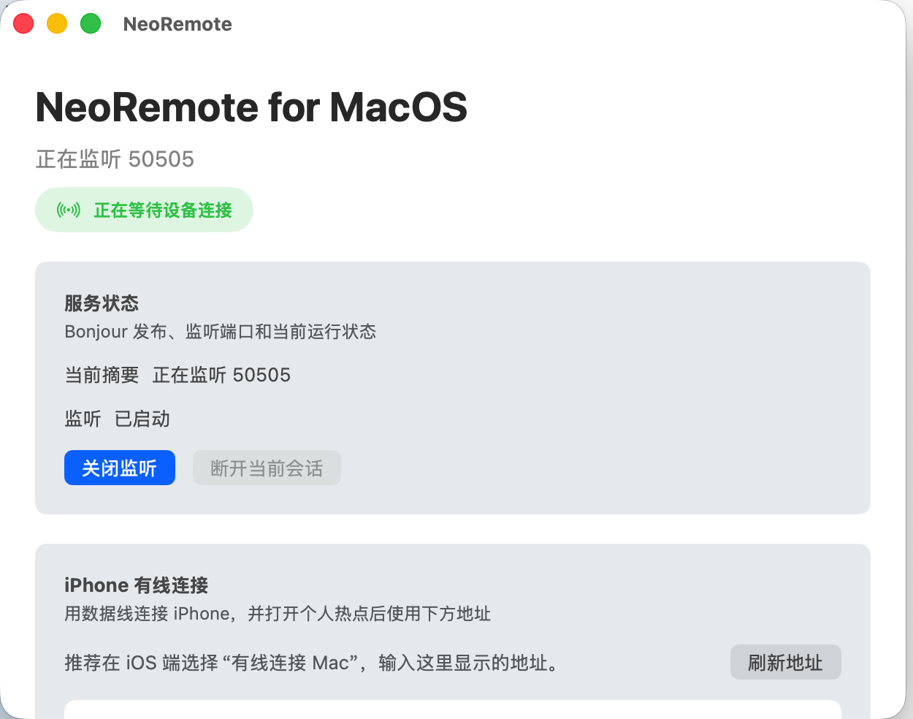

<p align="center">
  
</p>

<h1 align="center">NeoRemote</h1>

<p align="center">
  <a href="README_CN.md">中文</a> | <strong>English</strong>
</p>

<p align="center">
  A cross-device input tool built natively for four platforms: control your desktop from your phone, or control Android devices from iOS / Android.
</p>

<p align="center">
  <strong>iOS</strong> · <strong>Android</strong> · <strong>macOS</strong> · <strong>Windows</strong>
</p>

<p align="center">
  <a href="https://github.com/Souitou-iop/NeoRemote/actions/workflows/build-all.yml"></a>
  <a href="https://github.com/Souitou-iop/NeoRemote/releases/tag/vbeta-10"></a>
  
  
</p>

<p align="center">
  <a href="https://github.com/Souitou-iop/NeoRemote/releases/tag/vbeta-10">Latest beta: vbeta-10</a>
  ·
  <a href="https://github.com/Souitou-iop/NeoRemote/actions/workflows/build-all.yml">Build all artifacts</a>
  ·
  <a href="https://github.com/Souitou-iop/NeoRemote/actions/workflows/beta-release.yml">Beta release</a>
</p>

---

## Table of Contents

- [Overview](#overview)
- [Tech Stack](#tech-stack)
- [Features](#features)
- [Screenshots](#screenshots)
- [Product Roadmap](#product-roadmap)
- [Getting Started](#getting-started)
- [Protocol & Connectivity](#protocol--connectivity)
- [Android Controlled Device](#android-controlled-device)
- [Repository Structure](#repository-structure)
- [CI & Release](#ci--release)
- [Security](#security)
- [Troubleshooting](#troubleshooting)
- [Contributing](#contributing)
- [Scope & Boundaries](#scope--boundaries)
- [Reference Documents](#reference-documents)
- [License](#license)

---

## Overview

NeoRemote currently provides two working control chains:

- **Mobile → Desktop**: iOS / Android act as controllers, discovering desktops on the LAN and sending taps, swipes, and basic input commands. macOS / Windows act as desktop receivers, injecting commands as native system mouse events.
- **Mobile → Android**: An Android device can publish itself as a controlled target via AccessibilityService. Once connected, iOS / Android controllers can execute screen gestures, system navigation, and video-specific actions.

The project is built with **four native platform implementations** — no Flutter, React Native, or Electron wrappers — to ensure optimal performance and user experience on each platform.

## Tech Stack

| Platform | Stack | Current Role |
| --- | --- | --- |
| **iOS** | Swift / SwiftUI / UIKit / Network.framework | Mobile controller with screen control and short video modes |
| **Android** | Kotlin / Jetpack Compose / Android NSD / Socket / AccessibilityService | Mobile controller + Android controlled device |
| **macOS** | Swift Package / SwiftUI / AppKit / CoreGraphics | Desktop receiver with accessibility permission detection and mouse event injection |
| **Windows** | C++20 / Win32 / SendInput | Desktop receiver with discovery, listening, and input injection |

## Features

- **Auto Discovery + Manual Connect**: The controller automatically discovers desktops or Android targets on the same subnet, with IP/port manual connection as a fallback.
- **Screen Control Mode**: A large mirrored touch surface sends taps and full-screen directional gestures, letting the Android controlled device execute them proportionally; desktop receivers still accept basic input commands.
- **Short Video Mode**: Switch to a dedicated video control panel from the top-right corner of the Remote page. Supports next, previous, swipe left/right, like, favorite, play/pause, and back.
- **Independent Default Mode**: The default control mode in Settings only affects the next connection session; the toggle in the Remote top-right corner only changes the current session.
- **Android Controlled Device**: Android receives TCP commands via AccessibilityService and executes taps, swipes, video actions, and system navigation. A built-in action queue prevents rapid-fire commands from canceling each other, and self-connection is blocked.
- **Android Accessibility Actions**: The Android controlled device supports accessibility-based tap actions for specific app UI elements (e.g., Douyin/TikTok like and favorite buttons), enabling precise automation beyond coordinate-based gestures.
- **Native Desktop Injection**: macOS uses CoreGraphics, Windows uses SendInput. No remote screen mirroring.
- **Unified CI / Beta Release**: GitHub Actions builds iOS IPA, Android APK, macOS app zip, and Windows receiver zip, and can create beta prereleases.
- **Shared Brand Assets**: `resources/brand/icons/NeoRemote.icon` is the primary icon source. The repository also retains iOS / watchOS export icons and visual assets.

## Screenshots

Screenshots are from the current iOS simulator build and macOS receiver. The mobile Remote page now uses **Screen Control / Short Video** as the primary control modes.

<table>
  <tr>
    <th>Onboarding</th>
    <th>Screen Control</th>
    <th>Short Video Mode</th>
  </tr>
  <tr>
    <td></td>
    <td></td>
    <td></td>
  </tr>
  <tr>
    <th>Devices</th>
    <th>Settings</th>
  </tr>
  <tr>
    <td></td>
    <td></td>
  </tr>
</table>

### Desktop

<table>
  <tr>
    <th>macOS Receiver</th>
  </tr>
  <tr>
    <td></td>
  </tr>
</table>

## Product Roadmap

| Stage | Goal | Status |
| --- | --- | --- |
| Mobile → Desktop | Use phone as wireless input to control macOS / Windows | ✅ Available |
| Android Controlled Device | Android as discoverable, connectable, controllable target | ✅ Available |
| Screen Control Mode | Large touch surface mapping to Android target taps and full-screen gestures | ✅ Available |
| Short Video Mode | Dedicated buttons for next/prev, swipe left/right, like, favorite, play/pause, back | ✅ Available |
| Four-Platform Build Artifacts | Unified build and beta release for iOS, Android, macOS, Windows | ✅ Available |
| Keyboard Input | Remote soft keyboard input to desktop | 📋 Planned |
| Quick Actions | Custom hotkeys and gesture macros | 📋 Planned |
| Trusted Device Policy | Device trust management and auto-authorization | 📋 Planned |
| Multi-Client Arbitration | Priority management when multiple controllers connect simultaneously | 📋 Planned |

### Latest Beta

Current latest beta: **vbeta-10**

Release page: https://github.com/Souitou-iop/NeoRemote/releases/tag/vbeta-10

Included artifacts:

| Artifact | Description |
| --- | --- |
| `NeoRemote-ios-unsigned.ipa` | Unsigned IPA; requires signing or installation per your dev/test environment |
| `NeoRemote-android-release-unsigned.apk` | Unsigned APK; signed APK is produced when signing secrets are configured in the `Build all artifacts` workflow |
| `NeoRemote-macos.zip` | Local testing build, not notarized |
| `NeoRemote-windows-receiver.zip` | Windows desktop receiver |

## Getting Started

### Prerequisites

| Platform | Requirements |
| --- | --- |
| iOS | macOS, Xcode, iOS 17.0+ deployment target |
| Android | JDK 21, Android SDK (compileSdk 36, minSdk 26 / Android 8.0+) |
| macOS | macOS 15+, Swift 6 toolchain / Xcode, Accessibility permission |
| Windows | Windows 10/11, Visual Studio 2022, Desktop development with C++, Windows 10/11 SDK |

### iOS

```bash
# Simulator build
xcodebuild build \
  -project iOS/NeoRemote.xcodeproj \
  -scheme NeoRemote \
  -destination 'generic/platform=iOS Simulator'

# Device build
xcodebuild build \
  -project iOS/NeoRemote.xcodeproj \
  -scheme NeoRemote \
  -destination 'id=<DEVICE_ID>' \
  -configuration Debug

# Unsigned archive
xcodebuild archive \
  -project iOS/NeoRemote.xcodeproj \
  -scheme NeoRemote \
  -configuration Release \
  -destination 'generic/platform=iOS' \
  -archivePath /tmp/NeoRemote-unsigned.xcarchive \
  CODE_SIGNING_ALLOWED=NO \
  CODE_SIGNING_REQUIRED=NO \
  CODE_SIGN_IDENTITY=
```

### Android

```bash
cd Android
./gradlew :app:testDebugUnitTest    # Run unit tests
./gradlew :app:assembleDebug        # Build debug APK
./gradlew :app:assembleRelease      # Build release APK

# Install debug APK
adb install -r app/build/outputs/apk/debug/app-debug.apk
```

### macOS

Accessibility permission: **System Settings → Privacy & Security → Accessibility**

```bash
swift test --package-path MacOS                    # Run tests
swift build -c release --package-path MacOS        # Release build
./MacOS/script/build_and_run.sh                    # Build and launch
./MacOS/script/build_and_run.sh --verify           # Launch and verify startup
```

Build output: `MacOS/dist/NeoRemoteMac.app`

### Windows

```powershell
./Windows/scripts/build_receiver.ps1
```

Build output: `Windows/build/NeoRemote.WindowsReceiver.exe`

### Connection Methods

1. **Auto Discovery**: Controller and desktop/Android target on the same LAN are automatically discovered.
2. **Manual Connect**: Enter the desktop IP and port on the controller.
3. **ADB Wired Debug** (Android): `adb reverse tcp:51101 tcp:51101`

## Protocol & Connectivity

NeoRemote uses **JSON over TCP**. The controller sends commands, and the target or desktop returns `ack / status / heartbeat`.

### Discovery Methods

| Method | Description |
| --- | --- |
| Bonjour / DNS-SD | Service type `_neoremote._tcp.` |
| UDP fallback | Port `51101`, request `NEOREMOTE_DISCOVER_V1`, response prefix `NEOREMOTE_DESKTOP_V1` |

When the Android controlled device has AccessibilityService enabled, it publishes as a discoverable device. Controllers identify it as an Android endpoint. The Android controller filters out its own device to prevent self-connection.

### Default Ports

| Target | Default Port |
| --- | --- |
| macOS desktop receiver | `50505` |
| Windows desktop receiver | `51101` |
| Android controlled device | `51101` |
| Android ADB wired debug | `127.0.0.1:51101` |

### Control Commands

```json
{ "type": "clientHello", "clientId": "...", "displayName": "iPhone", "platform": "ios" }
{ "type": "tap", "button": "primary" }
{ "type": "move", "dx": 12.3, "dy": -4.8 }
{ "type": "scroll", "deltaX": 0.0, "deltaY": 18.0 }
{ "type": "drag", "state": "started", "dx": 0.0, "dy": 0.0, "button": "primary" }
{ "type": "screenGesture", "kind": "swipe", "startX": 0.5, "startY": 0.8, "endX": 0.5, "endY": 0.2, "durationMs": 260 }
{ "type": "systemAction", "action": "back" }
{ "type": "videoAction", "action": "swipeUp" }
{ "type": "heartbeat" }
```

<details>
<summary><strong>Supported videoAction values</strong></summary>

| action | Behavior |
| --- | --- |
| `swipeUp` | Next video |
| `swipeDown` | Previous video |
| `swipeLeft` | Swipe left |
| `swipeRight` | Swipe right |
| `doubleTapLike` | Like |
| `favorite` | Favorite |
| `playPause` | Play / Pause |
| `back` | Back |

</details>

<details>
<summary><strong>Response format</strong></summary>

```json
{ "type": "ack" }
{ "type": "status", "message": "Android controlled device connected" }
{ "type": "heartbeat" }
```

</details>

## Android Controlled Device

The Android controlled device relies on the system AccessibilityService:

1. Install the Android app.
2. Open system Accessibility settings.
3. Enable the NeoRemote accessibility service.
4. Keep the Android device and controller on the same LAN, or use ADB wired debug.
5. Once an iOS / Android controller discovers and connects to the Android device, screen control or short video mode commands can be executed.

The controlled device implementation includes:

| Component | Responsibility |
| --- | --- |
| TCP receiver | Receives JSON commands and returns status |
| Android NSD / UDP responder | Makes the Android controlled device discoverable by controllers |
| Accessibility gesture injection | Executes taps, swipes, and system navigation |
| Screen gesture planner | Plans taps and directional swipes based on the controlled device screen size; the controller does not depend on cursor position |
| Action queue | Executes consecutive video actions serially via completion callbacks, reducing Accessibility gesture conflicts |

## Repository Structure

```text
.
├── Android/                         # Android controller + Android controlled device
│   ├── app/src/main/java/...        #   Kotlin / Jetpack Compose
│   └── vendor/AndroidLiquidGlass/   #   Liquid Glass UI composite-build dependency
├── iOS/                             # iOS controller
│   ├── NeoRemote/Core/              #   Session management, protocol, transport, discovery
│   ├── NeoRemote/Features/          #   Remote, Devices, Settings, Onboarding
│   └── NeoRemoteTests/              #   Unit tests
├── MacOS/                           # macOS desktop receiver
│   ├── Sources/NeoRemoteMac/        #   Swift Package structure
│   ├── Tests/                       #   Unit tests
│   └── script/                      #   Build and run script
├── Windows/                         # Windows desktop receiver
│   ├── src/NeoRemote.Core/          #   C++ core (protocol, input injection)
│   ├── src/NeoRemote.Windows/       #   Win32 layer (TCP, UDP, Tray)
│   ├── tests/                       #   Unit tests
│   └── scripts/                     #   Build script
├── resources/                       # Brand assets and README screenshots
│   ├── brand/                       #   Icon Composer source, exports, artwork, icons
│   └── screenshots/                 #   README demo screenshots
├── scripts/                         # Cross-platform resource sync scripts
├── docs/                            # Project documentation
└── .github/workflows/               # Four-platform build and beta release
```

## CI & Release

### Build all artifacts

Pushing to `main` or manually triggering `Build all artifacts` builds:

- **iOS**: `NeoRemote-unsigned-ipa`
- **Android**: `NeoRemote-android-apk` (signed APK produced when signing secrets are configured)
- **macOS**: `NeoRemoteMac`
- **Windows**: `NeoRemoteWindowsReceiver`

Android release signing relies on GitHub Secrets:

| Secret Name | Purpose |
| --- | --- |
| `ANDROID_RELEASE_KEYSTORE_BASE64` | Base64-encoded keystore file |
| `ANDROID_RELEASE_KEYSTORE_PASSWORD` | Keystore password |
| `ANDROID_RELEASE_KEY_ALIAS` | Key alias |
| `ANDROID_RELEASE_KEY_PASSWORD` | Key password |

### Beta release

Manually trigger the `Beta release` workflow to create a GitHub prerelease:

```bash
gh workflow run beta-release.yml --ref main -f version=vbeta-10
```

### Icon sync

NeoRemote uses `resources/brand/icons/NeoRemote.icon` as the single icon design source. After adjusting the Icon Composer file, run:

```bash
./scripts/sync_icons.sh
```

This syncs to iOS (Xcode assets), macOS (`AppIcon.icns`), Android (`mipmap-*`), and Windows (`NeoRemote.ico`).

## Security

NeoRemote is a LAN-based input control tool. The current security boundaries are:

- **Transport layer**: Uses plaintext JSON over TCP, with no TLS encryption. Use only on trusted home or office LANs.
- **Discovery protocol**: UDP discovery and Bonjour are both plaintext; malicious devices can spoof discovery responses. Ensure the LAN environment is trusted.
- **Connection authorization**: macOS supports connection approval (approve/reject); Windows and Android controlled device authorization is being improved.
- **Android Accessibility**: Granting Accessibility permission means the app can perform any screen operation. Enable only after understanding the risks.

Future plans:

- Optional TLS transport support
- Pre-shared key (PSK) connection authentication
- UDP discovery protocol signature verification

## Troubleshooting

<details>
<summary><strong>Controller cannot discover desktop</strong></summary>

1. Confirm the controller and desktop are on the same LAN (same subnet).
2. Check that the desktop is running and listening (macOS: menu bar icon shows ⚡; Windows: check tray icon status).
3. Try manual connection by entering the desktop IP and port directly.
4. Check that the firewall allows the corresponding port (macOS: 50505, Windows: 51101).

</details>

<details>
<summary><strong>macOS: connected but cannot control mouse</strong></summary>

Accessibility permission is required: **System Settings → Privacy & Security → Accessibility**, check NeoRemote. Restart the app after authorization.

</details>

<details>
<summary><strong>Android controlled device: gestures not executing</strong></summary>

1. Confirm the NeoRemote accessibility service is enabled in system Accessibility settings.
2. Some Android OEMs restrict background accessibility services. Set NeoRemote to "Unrestricted" in battery optimization settings.
3. Confirm the Android controlled device screen is on.

</details>

<details>
<summary><strong>ADB wired debug connection</strong></summary>

```bash
adb reverse tcp:51101 tcp:51101
```

Then manually connect to `127.0.0.1:51101` from the controller.

</details>

## Contributing

Contributions to NeoRemote are welcome. Here is the basic workflow:

### Development Environment

1. Fork and clone this repository.
2. Set up the development environment for the target platform per [Getting Started](#getting-started).
3. Create a feature branch: `git checkout -b feature/your-feature`

### Code Standards

- **iOS/macOS**: Follow Swift API Design Guidelines, use Swift 6 concurrency model.
- **Android**: Follow Kotlin coding conventions, use Jetpack Compose for UI.
- **Windows**: Follow C++20 standard, use modern C++ features.
- **Commit messages**: Use clear descriptions explaining what changed and why.

### Testing

Before submitting code, ensure the relevant platform tests pass:

```bash
# iOS
xcodebuild test -project iOS/NeoRemote.xcodeproj -scheme NeoRemote -destination 'platform=iOS Simulator,name=iPhone 16'

# Android
cd Android && ./gradlew :app:testDebugUnitTest

# macOS
swift test --package-path MacOS
```

### Submission Process

1. Ensure all tests pass.
2. Update relevant documentation (if applicable).
3. Submit a Pull Request with a description of changes and motivation.
4. Wait for CI build to pass and for code review.

### Protocol Extension

When extending the protocol, maintain compatibility with existing JSON v1 messages. New command types should:

1. Be added simultaneously to `RemoteCommand` enum (iOS/macOS), `RemoteCommand` type (Android), and `RemoteCommandType` enum (Windows).
2. Have encoding/decoding implemented in `ProtocolCodec`.
3. Be documented in the README protocol section.

## Scope & Boundaries

NeoRemote is an **input control tool**, not a remote desktop.

Currently out of scope by default:

- Screen mirroring / video streaming
- File transfer
- In-app data read/write
- iPhone as a system-level controlled device
- Complex account systems or end-to-end encryption
- Multi-client simultaneous control arbitration

Future protocol extensions should maintain compatibility with existing JSON v1 messages before adding new capabilities.

## Reference Documents

| Document | Content |
| --- | --- |
| [Windows README](Windows/README.md) | Windows receiver details |

## License

This project is licensed under the [MIT License](LICENSE).

For questions or suggestions, please use [Issues](https://github.com/Souitou-iop/NeoRemote/issues).
