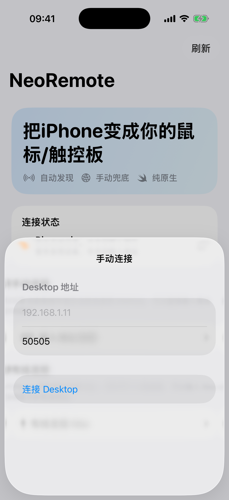

<p align="center">
  
</p>

<h1 align="center">NeoRemote</h1>

<p align="center">
  <strong>中文</strong> | <a href="README.md">English</a>
</p>

<p align="center">
  四端原生的跨设备输入工具：手机控制桌面端，也可以用 iOS / Android 控制 Android 被控端。
</p>

<p align="center">
  <strong>iOS</strong> · <strong>Android</strong> · <strong>macOS</strong> · <strong>Windows</strong>
</p>

<p align="center">
  <a href="https://github.com/Souitou-iop/NeoRemote/actions/workflows/build-all.yml"></a>
  <a href="https://github.com/Souitou-iop/NeoRemote/releases/tag/vbeta-10"></a>
  
  
</p>

<p align="center">
  <a href="https://github.com/Souitou-iop/NeoRemote/releases/tag/vbeta-10">Latest beta: vbeta-10</a>
  ·
  <a href="https://github.com/Souitou-iop/NeoRemote/actions/workflows/build-all.yml">Build all artifacts</a>
  ·
  <a href="https://github.com/Souitou-iop/NeoRemote/actions/workflows/beta-release.yml">Beta release</a>
</p>

---

## 目录

- [项目概述](#项目概述)
- [技术栈](#技术栈)
- [核心能力](#核心能力)
- [演示截图](#演示截图)
- [产品进度](#产品进度)
- [快速开始](#快速开始)
- [协议与连接](#协议与连接)
- [Android 被控端](#android-被控端)
- [仓库结构](#仓库结构)
- [CI 与发布](#ci-与发布)
- [安全说明](#安全说明)
- [故障排除](#故障排除)
- [贡献指南](#贡献指南)
- [开发边界](#开发边界)
- [参考文档](#参考文档)
- [许可证](#许可证)

---

## 项目概述

NeoRemote 当前已经形成两条可用链路：

- **移动端控制桌面端**：iOS / Android 作为控制端，通过局域网发现 Desktop，发送屏幕点按、滑动和基础输入；macOS / Windows 作为桌面接收端，把命令注入为系统鼠标事件。
- **移动端控制 Android**：Android 可通过 AccessibilityService 作为被控端发布服务；iOS / Android 控制端连接后可执行屏幕手势、系统返回，以及面向短视频 App 的视频控制动作。

项目坚持**四端原生实现**，不使用 Flutter、React Native、Electron 等跨端壳，以保证各平台最优的性能和用户体验。

## 技术栈

| 平台 | 技术栈 | 当前角色 |
| --- | --- | --- |
| **iOS** | Swift / SwiftUI / UIKit / Network.framework | 移动控制端，支持屏幕控制与短视频模式 |
| **Android** | Kotlin / Jetpack Compose / Android NSD / Socket / AccessibilityService | 移动控制端 + Android 被控端 |
| **macOS** | Swift Package / SwiftUI / AppKit / CoreGraphics | 桌面接收端，支持辅助功能权限检测与鼠标事件注入 |
| **Windows** | C++20 / Win32 / SendInput | 桌面接收端，支持发现、监听与输入注入 |

## 核心能力

- **自动发现 + 手动连接**：控制端可自动发现同网段的 Desktop 或 Android 被控端，也保留 IP/端口手动兜底。
- **屏幕控制模式**：移动端用大面积镜像触控区发送点按和全面屏方向手势，让 Android 被控端按屏幕比例执行操作；桌面端仍兼容基础输入命令。
- **短视频模式**：连接后可在 Remote 页右上角快速切换到专用视频控制面板，支持上一条、下一条、左滑、右滑、点赞、收藏、播放/暂停、返回。
- **默认模式独立设置**：Settings 中的默认控制模式只影响下次进入连接页，Remote 右上角切换只改变当前会话。
- **Android 被控端**：Android 通过辅助功能接收 TCP 指令并执行点击、滑动、短视频动作和系统导航；内置动作队列，避免高频指令互相取消，并限制 Android 设备连接自身。
- **Android 无障碍精准操作**：Android 被控端支持基于 AccessibilityService 的精准 UI 元素操作（如抖音点赞、收藏按钮），实现超越坐标手势的精确自动化。
- **桌面端原生注入**：macOS 使用 CoreGraphics，Windows 使用 SendInput，不做远程桌面画面回传。
- **统一 CI / Beta 发布**：GitHub Actions 可构建 iOS IPA、Android APK、macOS app zip 和 Windows receiver zip，并创建 beta prerelease。
- **同源品牌资源**：`resources/icons/NeoRemote.icon` 是主图标源，仓库同时保留 iOS / watchOS 导出图标和视觉资产。

## 演示截图

以下截图来自当前 iOS 模拟器构建和 macOS 接收端。移动端 Remote 页现在以 `屏幕控制 / 短视频` 为主要控制方式。

<table>
  <tr>
    <th>连接引导</th>
    <th>手动连接</th>
    <th>屏幕控制</th>
  </tr>
  <tr>
    <td></td>
    <td></td>
    <td></td>
  </tr>
  <tr>
    <th>短视频模式</th>
    <th>设备页</th>
    <th>设置页</th>
  </tr>
  <tr>
    <td></td>
    <td></td>
    <td></td>
  </tr>
</table>

### Desktop

<table>
  <tr>
    <th>macOS 接收端</th>
  </tr>
  <tr>
    <td></td>
  </tr>
</table>

## 产品进度

| 阶段 | 目标 | 状态 |
| --- | --- | --- |
| 移动端控制桌面端 | 手机作为无线输入控制 macOS / Windows | ✅ 可用 |
| Android 被控端 | Android 作为可发现、可连接、可控制的被控端 | ✅ 可用 |
| 屏幕控制模式 | 大面积触控区映射 Android 被控端点按和全面屏手势 | ✅ 可用 |
| 短视频模式 | 独立按钮控制短视频 App 的上下滑、左右滑、点赞、收藏、播放、返回 | ✅ 可用 |
| 四端构建产物 | iOS、Android、macOS、Windows 统一构建和 beta 发布 | ✅ 可用 |
| 键盘输入 | 软键盘远程输入到桌面端 | 📋 规划中 |
| 快捷动作 | 自定义快捷键和手势宏 | 📋 规划中 |
| 可信设备策略 | 设备信任管理与自动授权 | 📋 规划中 |
| 多客户端仲裁 | 多台控制端同时连接时的优先级管理 | 📋 规划中 |

### 最新 Beta

当前最新 beta 版本：**vbeta-10**

Release 页面：https://github.com/Souitou-iop/NeoRemote/releases/tag/vbeta-10

包含产物：

| 产物 | 说明 |
| --- | --- |
| `NeoRemote-ios-unsigned.ipa` | unsigned IPA，需要按开发/测试环境自行签名或安装 |
| `NeoRemote-android-release-unsigned.apk` | unsigned APK；`Build all artifacts` workflow 在配置签名 secrets 时会产出 signed APK |
| `NeoRemote-macos.zip` | 本地测试用构建，未做 notarization |
| `NeoRemote-windows-receiver.zip` | Windows 桌面接收端 |

## 快速开始

### 前提条件

| 平台 | 要求 |
| --- | --- |
| iOS | macOS、Xcode、iOS 17.0+ 部署目标 |
| Android | JDK 21、Android SDK（compileSdk 36、minSdk 26 / Android 8.0+） |
| macOS | macOS 15+、Swift 6 toolchain / Xcode、辅助功能权限 |
| Windows | Windows 10/11、Visual Studio 2022、Desktop development with C++、Windows 10/11 SDK |

### iOS

```bash
# 模拟器构建
xcodebuild build \
  -project iOS/NeoRemote.xcodeproj \
  -scheme NeoRemote \
  -destination 'generic/platform=iOS Simulator'

# 真机构建
xcodebuild build \
  -project iOS/NeoRemote.xcodeproj \
  -scheme NeoRemote \
  -destination 'id=<DEVICE_ID>' \
  -configuration Debug

# 无签名归档
xcodebuild archive \
  -project iOS/NeoRemote.xcodeproj \
  -scheme NeoRemote \
  -configuration Release \
  -destination 'generic/platform=iOS' \
  -archivePath /tmp/NeoRemote-unsigned.xcarchive \
  CODE_SIGNING_ALLOWED=NO \
  CODE_SIGNING_REQUIRED=NO \
  CODE_SIGN_IDENTITY=
```

### Android

```bash
cd Android
./gradlew :app:testDebugUnitTest    # 运行单元测试
./gradlew :app:assembleDebug        # 构建 debug APK
./gradlew :app:assembleRelease      # 构建 release APK

# 安装 debug APK
adb install -r app/build/outputs/apk/debug/app-debug.apk
```

### macOS

辅助功能权限：**系统设置 → 隐私与安全性 → 辅助功能**

```bash
swift test --package-path MacOS                    # 运行测试
swift build -c release --package-path MacOS        # Release 构建
./MacOS/script/build_and_run.sh                    # 构建并启动
./MacOS/script/build_and_run.sh --verify           # 验证启动状态
```

构建产物：`MacOS/dist/NeoRemoteMac.app`

### Windows

```powershell
./Windows/scripts/build_receiver.ps1
```

构建产物：`Windows/build/NeoRemote.WindowsReceiver.exe`

### 连接方式

1. **自动发现**：控制端与桌面端/Android 被控端在同一局域网，自动扫描发现。
2. **手动连接**：在控制端输入桌面端 IP 和端口。
3. **ADB 有线调试**（Android）：`adb reverse tcp:51101 tcp:51101`

## 协议与连接

NeoRemote 当前协议是 **JSON over TCP**。控制端发送命令，被控端或桌面端返回 `ack / status / heartbeat`。

### 发现方式

| 方式 | 说明 |
| --- | --- |
| Bonjour / DNS-SD | 服务类型 `_neoremote._tcp.` |
| UDP fallback | 端口 `51101`，请求 `NEOREMOTE_DISCOVER_V1`，响应前缀 `NEOREMOTE_DESKTOP_V1` |

Android 被控端启用辅助功能后，会发布为可发现设备；控制端会把它识别为 Android endpoint。Android 控制端会过滤自身设备，避免出现"自己控制自己"的误连接。

### 默认端口

| 目标 | 默认端口 |
| --- | --- |
| macOS 桌面接收端 | `50505` |
| Windows 桌面接收端 | `51101` |
| Android 被控端 | `51101` |
| Android ADB 有线调试 | `127.0.0.1:51101` |

### 控制命令

```json
{ "type": "clientHello", "clientId": "...", "displayName": "iPhone", "platform": "ios" }
{ "type": "tap", "button": "primary" }
{ "type": "move", "dx": 12.3, "dy": -4.8 }
{ "type": "scroll", "deltaX": 0.0, "deltaY": 18.0 }
{ "type": "drag", "state": "started", "dx": 0.0, "dy": 0.0, "button": "primary" }
{ "type": "screenGesture", "kind": "swipe", "startX": 0.5, "startY": 0.8, "endX": 0.5, "endY": 0.2, "durationMs": 260 }
{ "type": "systemAction", "action": "back" }
{ "type": "videoAction", "action": "swipeUp" }
{ "type": "heartbeat" }
```

<details>
<summary><strong>videoAction 支持列表</strong></summary>

| action | 行为 |
| --- | --- |
| `swipeUp` | 下一条 |
| `swipeDown` | 上一条 |
| `swipeLeft` | 左滑 |
| `swipeRight` | 右滑 |
| `doubleTapLike` | 点赞 |
| `favorite` | 收藏 |
| `playPause` | 播放/暂停 |
| `back` | 返回 |

</details>

<details>
<summary><strong>回包格式</strong></summary>

```json
{ "type": "ack" }
{ "type": "status", "message": "Android 被控端已连接" }
{ "type": "heartbeat" }
```

</details>

## Android 被控端

Android 被控端依赖系统辅助功能：

1. 安装 Android app。
2. 打开系统辅助功能设置。
3. 启用 NeoRemote 辅助服务。
4. 保持 Android 和控制端在同一局域网，或使用 ADB forward 做有线调试。
5. iOS / Android 控制端发现并连接该 Android 设备后，即可执行屏幕控制或短视频模式命令。

被控端实现包含：

| 组件 | 职责 |
| --- | --- |
| TCP receiver | 接收 JSON 命令并返回状态 |
| Android NSD / UDP responder | 让控制端发现 Android 被控端 |
| Accessibility gesture injection | 执行点击、滑动和系统导航 |
| Screen gesture planner | 按被控端屏幕尺寸规划点按和上下左右滑动，控制端不依赖光标位置 |
| Action queue | 连续视频动作按完成回调串行执行，减少 Accessibility 手势互相取消 |

## 仓库结构

```text
.
├── Android/                         # Android 控制端 + Android 被控端
│   ├── app/src/main/java/...        #   Kotlin / Jetpack Compose
│   └── vendor/AndroidLiquidGlass/   #   Liquid Glass UI composite-build 依赖
├── iOS/                             # iOS 控制端
│   ├── NeoRemote/Core/              #   会话管理、协议、传输、发现
│   ├── NeoRemote/Features/          #   Remote、Devices、Settings、Onboarding
│   └── NeoRemoteTests/              #   单元测试
├── MacOS/                           # macOS 桌面接收端
│   ├── Sources/NeoRemoteMac/        #   Swift Package 结构
│   ├── Tests/                       #   单元测试
│   └── script/                      #   构建与运行脚本
├── Windows/                         # Windows 桌面接收端
│   ├── src/NeoRemote.Core/          #   C++ 核心层（协议、输入注入）
│   ├── src/NeoRemote.Windows/       #   Win32 层（TCP、UDP、Tray）
│   ├── tests/                       #   单元测试
│   └── scripts/                     #   构建脚本
├── resources/                       # 品牌资产、README 截图与资源工具
│   ├── icons/                       #   Icon Composer 源文件与导出图标
│   ├── screenshots/                 #   README 演示截图
│   └── scripts/                     #   全端资源同步脚本
├── docs/                            # 项目文档
└── .github/workflows/               # 四端构建与 beta 发布
```

## CI 与发布

### Build all artifacts

推送到 `main` 或手动触发 `Build all artifacts` 后会构建：

- **iOS**：`NeoRemote-unsigned-ipa`
- **Android**：`NeoRemote-android-apk`（签名依赖 Secrets 时产出 signed APK）
- **macOS**：`NeoRemoteMac`
- **Windows**：`NeoRemoteWindowsReceiver`

Android release 签名依赖 GitHub Secrets：

| Secret 名称 | 用途 |
| --- | --- |
| `ANDROID_RELEASE_KEYSTORE_BASE64` | Base64 编码的 keystore 文件 |
| `ANDROID_RELEASE_KEYSTORE_PASSWORD` | Keystore 密码 |
| `ANDROID_RELEASE_KEY_ALIAS` | Key 别名 |
| `ANDROID_RELEASE_KEY_PASSWORD` | Key 密码 |

### Beta release

手动触发 `Beta release` workflow 可创建 GitHub prerelease：

```bash
gh workflow run beta-release.yml --ref main -f version=vbeta-10
```

### 图标同步

NeoRemote 的应用图标以 `resources/icons/NeoRemote.icon` 为唯一设计源。调整 Icon Composer 文件后，运行：

```bash
./resources/scripts/sync_icons.sh
```

脚本会同步到 iOS（Xcode 资源）、macOS（`AppIcon.icns`）、Android（`mipmap-*`）、Windows（`NeoRemote.ico`）。

## 安全说明

NeoRemote 是局域网输入控制工具，当前的安全边界如下：

- **传输层**：当前使用明文 JSON over TCP，无 TLS 加密。建议仅在受信任的家庭或办公局域网内使用。
- **发现协议**：UDP 发现和 Bonjour 均为明文，恶意设备可以伪造发现响应。请确保局域网环境可信。
- **连接授权**：macOS 端支持连接审批（approve/reject）；Windows 端和 Android 被控端的授权机制正在完善中。
- **Android 辅助功能**：授予辅助功能权限意味着 app 可以执行任何屏幕操作，请仅在明确了解风险后启用。

后续计划：

- 可选 TLS 传输支持
- 基于预共享密钥（PSK）的连接认证
- UDP 发现协议签名校验

## 故障排除

<details>
<summary><strong>控制端发现不到桌面端</strong></summary>

1. 确认控制端和桌面端在同一局域网（同一子网）。
2. 检查桌面端是否已启动监听（macOS：菜单栏图标显示为 ⚡；Windows：检查托盘图标状态）。
3. 尝试使用手动连接方式，直接输入桌面端 IP 和端口。
4. 检查防火墙是否放行了对应端口（macOS: 50505，Windows: 51101）。

</details>

<details>
<summary><strong>macOS 端连接后无法控制鼠标</strong></summary>

需要授予辅助功能权限：**系统设置 → 隐私与安全性 → 辅助功能**，勾选 NeoRemote。授权后重启应用。

</details>

<details>
<summary><strong>Android 被控端无法执行手势</strong></summary>

1. 确认已在系统辅助功能设置中启用 NeoRemote 辅助服务。
2. 部分 Android 厂商对后台辅助功能有限制，需在电池优化中将 NeoRemote 设为"不受限"。
3. 确认 Android 被控端屏幕处于亮屏状态。

</details>

<details>
<summary><strong>ADB 有线调试连接</strong></summary>

```bash
adb reverse tcp:51101 tcp:51101
```

然后在控制端手动连接 `127.0.0.1:51101`。

</details>

## 贡献指南

欢迎对 NeoRemote 做出贡献。以下是参与开发的基本流程：

### 开发环境

1. Fork 并 clone 本仓库。
2. 按 [快速开始](#快速开始) 中对应平台的要求配置开发环境。
3. 创建功能分支：`git checkout -b feature/your-feature`

### 代码规范

开发前请阅读 [AGENTS.md](AGENTS.md)，了解平台规范、协议规则、安全约束和禁止事项。

- **iOS/macOS**：遵循 Swift API Design Guidelines，使用 Swift 6 concurrency 模型。
- **Android**：遵循 Kotlin 编码规范，UI 使用 Jetpack Compose。
- **Windows**：遵循 C++20 标准，使用现代 C++ 特性。
- **提交信息**：使用清晰的提交描述，说明变更内容和原因。

### 测试

提交代码前，请确保相关平台的测试通过：

```bash
# iOS
xcodebuild test -project iOS/NeoRemote.xcodeproj -scheme NeoRemote -destination 'platform=iOS Simulator,name=iPhone 16'

# Android
cd Android && ./gradlew :app:testDebugUnitTest

# macOS
swift test --package-path MacOS
```

### 提交流程

1. 确保代码通过所有测试。
2. 更新相关文档（如果适用）。
3. 提交 Pull Request，说明变更内容和动机。
4. 等待 CI 构建通过和代码审查。

### 协议扩展

扩展协议时，请保持现有 JSON v1 消息兼容。新增命令类型应：

1. 在 `RemoteCommand` 枚举（iOS/macOS）、`RemoteCommand` 类型（Android）、`RemoteCommandType` 枚举（Windows）中同步添加。
2. 在 `ProtocolCodec` 中同步实现编码/解码。
3. 更新 README 中的协议文档。

## 开发边界

NeoRemote 是**输入控制工具**，不是远程桌面。

当前默认不做：

- 屏幕画面回传
- 文件传输
- App 内数据读写
- iPhone 作为系统级被控端
- 复杂账号体系或端到端加密
- 多客户端同时控制同一目标的完整仲裁策略

后续扩展协议时，应保持现有 JSON v1 消息兼容，再新增能力。

## 参考文档

| 文档 | 内容 |
| --- | --- |
| [AGENTS.md](AGENTS.md) | Agent 开发指南、平台规范与约束 |
| [安全审查报告](resources/docs/security-review.md) | 完整安全审计报告 |
| [Android 签名规范](Android/android-signing-preset.md) | Android 签名工作流与约定 |
| [Windows README](Windows/README.md) | Windows 端详细说明 |

## 许可证

本项目采用 [MIT 许可证](LICENSE)。

如有疑问或建议，请通过 [Issues](https://github.com/Souitou-iop/NeoRemote/issues) 反馈。
